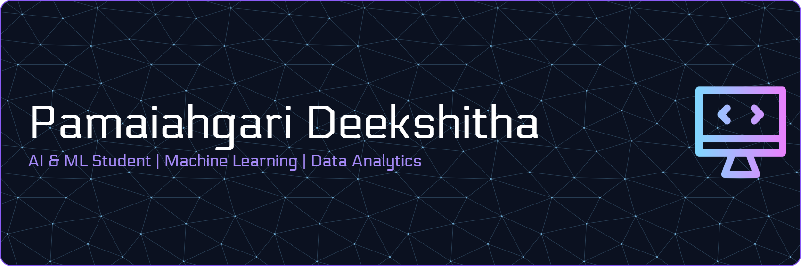

<!-- ==================== BANNER ==================== -->

  

<!-- ==================== INTRO ==================== -->

<h1 align="center">Hi 👋, I'm Deekshitha</h1>

<h3 align="center">
Artificial Intelligence & Machine Learning Student
</h3>

Building projects with Python, SQL, Machine Learning and Data Analytics.

---

## 👩‍💻 About Me

🎓 B.E. Student specializing in Artificial Intelligence & Machine Learning

💡 Passionate about:

- Artificial Intelligence
- Machine Learning
- Data Analytics
- Data Science
- Open Source Development
  

🌱 Currently focusing on:

- Python Development
- SQL
- Machine Learning
- Power BI
- Data Structures & Algorithms

🎯 Goal:

To leverage AI and data-driven technologies to solve real-world problems while continuously learning and building impactful solutions.

---

## 🛠️ Tech Stack

### Programming

### Database

### Tools & Platforms

### Core Areas

---

## 🚀 Currently Working On

- 🤖 Machine Learning Projects
- 📊 Power BI Dashboards
- 🧩 Data Structures & Algorithms
- 🗄️ SQL Practice & Analytics

---

## 📌 Featured Projects

### 🧠 Mental Health Chatbot

AI-powered chatbot designed to detect emotions from user input and provide supportive responses. Integrates emotion analysis and depression prediction techniques to promote mental well-being.

---

### 🌸 PCOS Detection System

Machine Learning-based healthcare application that predicts the likelihood of Polycystic Ovary Syndrome (PCOS) using medical and lifestyle parameters, enabling early awareness and risk assessment.

---

### 🍎 Fruit Quality Detection System

Computer Vision project that analyzes fruit images to identify quality, freshness, and defects. Built using image processing and machine learning techniques for automated quality assessment.

---

### 💰 Expense Tracker

A personal finance management application that helps users track income, expenses, spending patterns, and budgeting goals through an intuitive interface and data visualization.

---
---

## 📈 GitHub Statistics

---
##GitHub Trophies

## 🔥 GitHub Streak

---

## 📊 Contribution Graph

---

## 🎯 2026 Goals

- Build stronger Machine Learning projects
- Improve DSA problem-solving skills
- Contribute to Open Source projects
- Develop end-to-end AI applications
- Gain industry experience through internships

---

## 💭 Philosophy

> Continuous learning, consistent effort, and real-world projects create meaningful growth.

---
## 🌐 Connect With Me

---

✨ Learning • Building • Improving ✨

